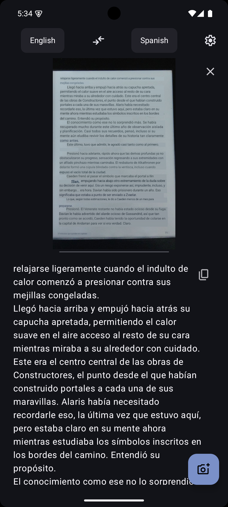
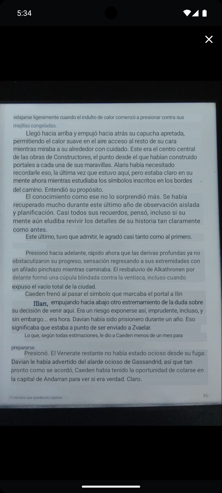

<h1><center>Translator</center></h1>

An Android translator app that uses on-device models to perform translation of text and images.

[](https://f-droid.org/packages/dev.davidv.translator)


## Features

- Image translation by overlaying on top of the original content
- Automatic language detection
- Transliteration for non-latin scripts

## Screenshots

[](fastlane/metadata/android/en-US/images/phoneScreenshots/01_main_interface.png)
[](fastlane/metadata/android/en-US/images/phoneScreenshots/02_image_translation.png)
[](fastlane/metadata/android/en-US/images/phoneScreenshots/04_image_translation_big.png)
[](fastlane/metadata/android/en-US/images/phoneScreenshots/03_transliteration.jpg)

## Tech

- Translation models are [firefox-translations-models](https://github.com/mozilla/firefox-translations-models/tree/main)
  - The translation models run on [bergamot-translator](https://github.com/browsermt/bergamot-translator)
- OCR models are [Tesseract4Android](https://github.com/adaptech-cz/Tesseract4Android)
- Automatic language detection is done via [cld2](https://github.com/CLD2Owners/cld2)

## Using on airgapped devices

If you want to use this app on a device with no internet access, you can put the language files on `Documents/dev.davidv.translator`. Check
`OFFLINE_SETUP.md` for details.

## Running on x86-64 emulator

This app works fine on aarch64, and it "works" on x86-64 -- in quotes because it currently requires `AVX2`, which is not available on the standard emulator, nor in the ABI.

You can be cheeky and run a VM with a good CPU configuration like this

```bash
cd $ANDROID_SDK/emulator
export LD_LIBRARY_PATH=$PWD/lib64:$PWD/lib64/qt/lib
$ANDROID_SDK/emulator/qemu/linux-x86_64/qemu-system-x86_64 -netdelay none -netspeed full -avd Medium_Phone_API_35 -qt-hide-window -grpc-use-token -idle-grpc-timeout 300 -qemu -cpu max
# The important bit is
# `-qemu -cpu max`
```

If you don't do this, you will just get a `SIGILL` when trying to load the library.

## Building

```sh
bash build.sh
```

will trigger a build in a docker container, matching the CI environment.

## Releasing

- Bump `app/build.gradle.kts` versionName and versionCode
- Create a changelog in `fastlane/metadata/android/en-US/changelogs` as `${versionCode}.txt`
- Create a tag that is `v${versionName}` (eg: `v0.1.0`)
- Create a Github release named `v${versionName}` (eg: `v0.1.0`)
  - Upload the _signed_ APK to the release

## Signing APK
```sh
bash sign-apk.sh keystore.jks keystorepass pass alias
```

will sign the file built by `build.sh` (`app/build/outputs/apk/aarch64/release/app-aarch64-release-unsigned.apk`) and place the signed copy, with version number, in `signed/`

